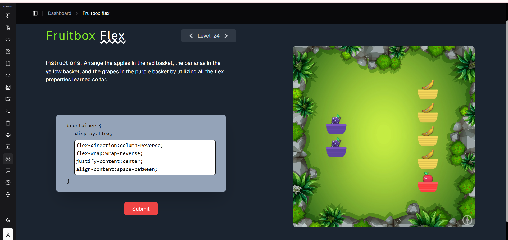

# 🎮 Flexbox Game Practice – Day 8

This project showcases my understanding of **CSS Flexbox** through hands-on practice using an interactive learning game.

## 🚀 About the Project

I completed **24 levels** of a Flexbox learning game on Code Help, where I practiced positioning elements using different Flexbox properties in a fun and visual way.

This helped me strengthen my core concepts of layout design and alignment in CSS.

## 🎯 What I Learned

Through this game, I gained practical experience with:

* `display: flex`
* `justify-content`
* `align-items`
* `flex-direction`
* `flex-wrap`
* `align-content`
* `align-self`

## 🧠 Key Concepts

* Difference between **main axis** and **cross axis**
* How to center elements horizontally & vertically
* Controlling spacing between elements
* Overriding alignment using `align-self`

## 📸 Preview

## 🕹️ Game Progress

* ✅ Completed: 24 Levels
* 🎯 Platform: Code Help Flexbox Game
* 💡 Focus: Layout alignment and positioning

## 📂 Project Structure
Day-07-Flexbox/
│
├── index.html
├── README.md
└── flex-game.png

## 💡 Why This Matters

Flexbox is an essential tool in modern web development. It helps in:

* Building responsive layouts
* Aligning elements easily
* Reducing complex CSS code

## 🔮 Next Steps

* Practice real-world layouts using Flexbox
* Learn CSS Grid for advanced layouts
* Build responsive UI components

✨ This project is part of my MERN Stack learning journey.
