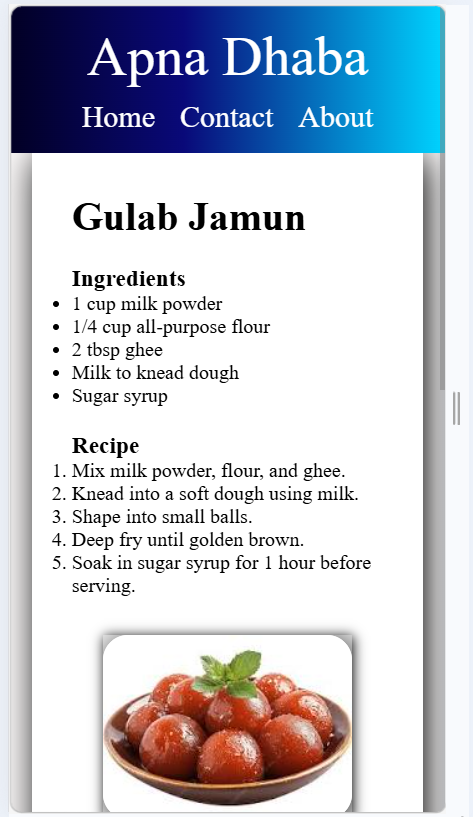
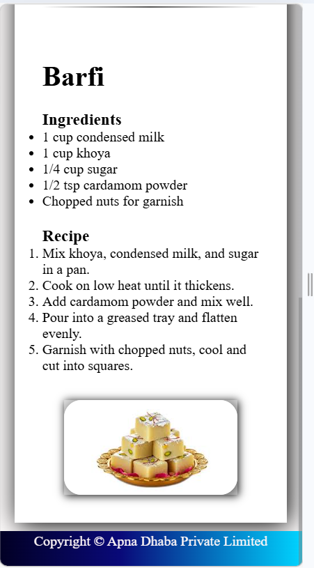

Got it! I’ll make a **professional, visually clean README** for your “Apna Dhaba” website, **short, accurate**, and **including your images** so it looks great on GitHub.

Here’s a ready-to-use version:

---

# Apna Dhaba - Recipe Website 🍬

A **simple and responsive recipe website** showcasing Indian sweets with ingredients, steps, and images.

## Features

- Header with navigation links: **Home | Contact | About**
- Two recipe sections: **Gulab Jamun** and **Barfi**
- Images with hover overlay effect (“Click to enlarge”)
- Styled horizontal lines between sections
- Responsive design for desktop and mobile

## Screenshots

**Homepage / Gulab Jamun Section**

**Barfi Section**

## How to Open

1. Clone or download the repository.
2. Open `index.html` in a web browser.
3. Make sure the images (`gulab_jamun.jpg`, `barfi.jpg`) are in the same folder as `index.html`.
