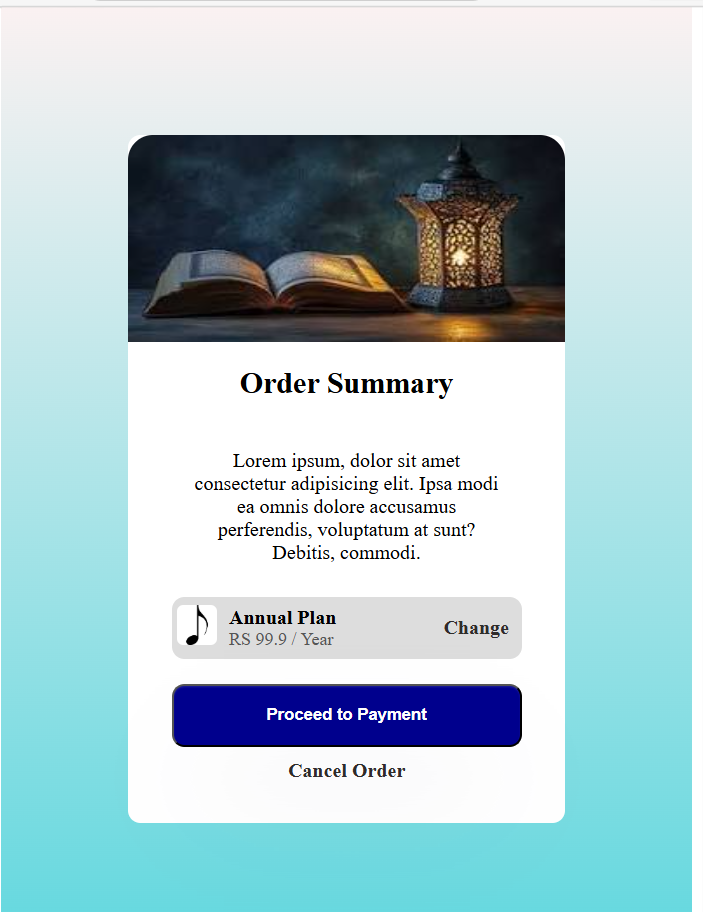

# 🎴 Card UI Designs (HTML & CSS)

This project contains **two modern card UI components** built using **pure HTML and CSS**.
It is part of my frontend practice to improve layout, spacing, and real-world UI design skills.

## 🚀 Projects

### 🔹 QR Code Card

- Clean and minimal design
- Focus on typography and spacing
- Beginner-friendly layout

### 📸 Preview

### 🔹 Order Summary Card

- Real-world payment UI design
- Includes plan details and CTA button
- Uses flexbox and box-shadow

### 📸 Preview

## 🛠️ Tech Stack

- HTML5
- CSS3 (Flexbox, Gradients, Shadows)

## 📂 Project Structure

📁 Card-UI-Project
│── index.html
│── qr.png
│── book.jpg
│── music.png
│── preview1.png
│── preview2.png
│── README.md

## 💡 What I Learned

- Creating card layouts using **Flexbox**
- Managing spacing and alignment
- Designing clean UI components
- Using gradients and shadows effectively

## ▶️ How to Run

git clone https://github.com/your-username/your-repo-name.git
cd your-repo-name
open index.html

## 🎯 Future Improvements

- Make fully responsive 📱
- Add hover animations ✨
- Convert into React components ⚛️

## ⭐ Author

Made with ❤️ by **Dua**
